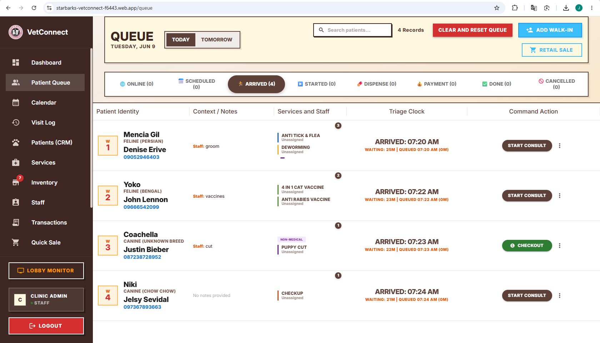
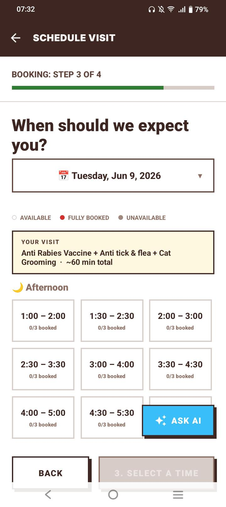
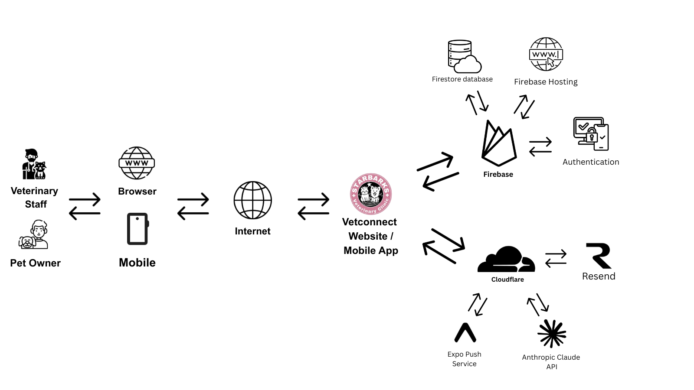

# VetConnect: Appointment and Record Management System for Starbarks Veterinary Clinic


A dual-surface veterinary clinic management system consisting of a web-based admin dashboard for clinic staff and a cross-platform mobile application for pet owners, sharing a single Firebase backend with a Cloudflare Worker providing AI, notification, and cron services.

**Capstone Project** | Universidad De Dagupan | School of Information Technology Education

## Screenshots

*Clinic staff manage the live visit queue on the admin dashboard; pet owners book appointments with real-time slot availability on the mobile app.*

**Admin — Live Visit Queue**



**Mobile — Appointment Booking**



## Engineering Highlights

- **Real-time everywhere** — the live queue, calendar, and booking grid update instantly through Firestore `onSnapshot` listeners, with no polling.
- **Concurrency-safe booking** — appointment slots are claimed inside Firestore transactions using deterministic reservation documents, preventing double-booking under race conditions (TOCTOU / optimistic concurrency control).
- **Serverless backend on Cloudflare Workers** — an AI proxy, push/email/SMS dispatch, and daily cron reminders run on a Worker, engineering around Firebase Spark-plan limits (no server-side Cloud Functions or triggers).
- **Five AI assistants** — Anthropic Claude powers clinical reasoning, calendar, booking advisor, pet-history Q&A, and an FAQ chatbot through the Worker proxy, with tunable system prompts and an append-only AI audit log.
- **Multi-channel notifications** — push (Expo), email (Resend), and SMS (Semaphore), plus automated vaccine, appointment, and balance reminders driven by pre-computed queues and a daily cron.
- **Forensic audit trail** — an append-only, tamper-evident "clinical pulse" engine with a dual-clock temporal model records every change to a visit.
- **Security-rules-first access control** — Firestore security rules are the enforcement layer, verified by a 134-test emulator suite covering both allow and deny paths.
- **Tested core** — 412 unit tests across the domain logic (clinical pulse engine, record amendments, billing, vitals, visit classification).

## Architecture

Pet owners and clinic staff reach VetConnect through the mobile app or the web dashboard. A shared **Firebase** backend handles data (Cloud Firestore), authentication, and admin hosting, while a **Cloudflare Worker** fronts the external services — Anthropic Claude for AI, Expo for push notifications, and Resend for email.



## Project Structure

This is a monorepo with three sub-projects:

```
VetConnect-Capstone/
  VetConnect/             # Mobile app (React Native + Expo SDK 54) — pet owners only
  VetConnect-Admin/       # Web admin dashboard (React 19 + Vite 7 + MUI 7) — clinic staff
  VetConnect-Backend/     # Cloud Functions (reference) + Cloudflare Worker (deployed)
```

## Tech Stack

| Layer | Technology |
|-------|-----------|
| Mobile App | React Native 0.81, Expo SDK 54, React 19, JavaScript |
| Admin Dashboard | React 19, Vite 7, Material UI 7, JavaScript |
| Database | Firebase Cloud Firestore (33 collections) |
| Authentication | Firebase Authentication (email/password) |
| Hosting | Firebase Hosting (admin dashboard) |
| Backend Services | Cloudflare Worker (AI proxy, push/email/SMS, cron reminders) |
| AI | Anthropic Claude API (Haiku model) via Worker proxy |
| Push Notifications | Expo Push API |
| Email | Resend API |
| SMS | Semaphore API (Philippine gateway) |
| Testing | Vitest — 412 unit tests + 134 Firestore security-rules tests |

## Prerequisites

- Node.js 20+
- npm 9+
- Firebase CLI (`npm install -g firebase-tools`)
- EAS CLI (`npm install -g eas-cli`) — for mobile builds (the project uses the local Expo CLI via `npx expo`, so no global Expo install is needed)
- Android Studio or Xcode — for mobile emulator/simulator
- A Firebase project on the Spark (free) plan

## Setup & Installation

### 1. Clone the repository

```bash
git clone https://github.com/jepdd15/VetConnect-Ecosystem.git
cd VetConnect-Ecosystem
```

### 2. Mobile App (VetConnect/)

```bash
cd VetConnect
npm install
npx expo start
```

- Press `a` for Android emulator, `i` for iOS simulator, or `w` for web preview
- For a production APK: `eas build --platform android --profile preview`

### 3. Admin Dashboard (VetConnect-Admin/)

```bash
cd VetConnect-Admin
npm install
npm run dev
```

Opens at `http://localhost:5173`. Login with a staff account.

### 4. Backend (VetConnect-Backend/)

**Firestore Rules** (deployable on Spark plan):
```bash
cd VetConnect-Backend
firebase deploy --only firestore:rules
```

**Cloudflare Worker** (manual deploy):
1. Copy the contents of `VetConnect-Backend/cloudflare-worker/worker.js`
2. Go to Cloudflare Dashboard > Workers > cool-fire-2d53 > Edit Code
3. Select all > Paste > Deploy

**Cloud Functions** (requires Blaze plan — NOT deployed):
```bash
cd VetConnect-Backend/functions
npm install
npm run serve  # Local emulator only
```

## Build & Run Commands

### Mobile App
| Command | Description |
|---------|-------------|
| `npm start` | Expo dev server |
| `npm run android` | Android emulator |
| `npm run ios` | iOS simulator |
| `npm run web` | Web preview |
| `npm run lint` | ESLint |

### Admin Dashboard
| Command | Description |
|---------|-------------|
| `npm run dev` | Vite dev server (localhost:5173) |
| `npm run build` | Production build |
| `npm run preview` | Preview production build |
| `npm run lint` | ESLint |
| `npm test` | Run 412 unit tests (Vitest) |
| `firebase deploy --only hosting` | Deploy admin to Firebase Hosting (run after `npm run build`) |

## Firebase Configuration

Each sub-project has its own `firebaseConfig.js` pointing to the shared Firebase project (`starbarks-vetconnect-f6443`). The config contains only public client-side keys (API key, project ID, etc.) — no secrets.

## Environment Variables

The Cloudflare Worker requires these environment variables (set in Cloudflare Dashboard > Workers > Settings):

| Variable | Description |
|----------|-------------|
| `ANTHROPIC_API_KEY` | Claude API key for AI features |
| `FIREBASE_API_KEY` | Firebase web API key (for Firestore REST reads/writes) |
| `RESEND_API_KEY` | Resend email API key |
| `RESEND_FROM_EMAIL` | Sender address (default: `VetConnect <noreply@starbarks.vet>`) |
| `SEMAPHORE_API_KEY` | Semaphore SMS API key |
| `SEMAPHORE_SENDER_NAME` | SMS sender name (default: `STARBARKS`) |

## Key Features

### Pet Owner (Mobile App)
- Appointment booking with real-time slot availability
- Multi-channel reminders (push + email + SMS, 3-stage)
- Real-time queue position monitoring
- QR code self check-in
- Pet health history with vaccination tracking
- AI booking advisor and pet history Q&A
- Digital consent (DPA + waiver) with signature capture

### Clinic Staff (Admin Dashboard)
- 8-stage clinical queue management
- SOAP-format clinical workspace with structured diagnosis, vitals, prescriptions
- 5 AI assistants (clinical, calendar, booking, pet history, FAQ)
- Multi-dose vaccine series tracking
- Point-of-sale with payment method tracking
- 3-tier inventory management (medicine, medical supply, retail)
- 4-tab analytics dashboard (Today, Analytics, Financial, Performance)
- End-of-day close-out with Z-reports
- Printable records (client copy, internal copy, vaccination passport)
- Forensic clinical pulse audit trail

## Firestore Collections

33 root collections (plus sub-collections as noted):

`users` (sub: `recordFilterPresets`, `consent_records`), `pets` (sub: `problems`), `appointments`, `medical_records`, `sales`, `payments`, `services`, `inventory`, `inventory_categories`, `clinic_settings` (sub-docs: `general`, `llm_config`), `queue`, `slot_reservations`, `vaccine_reminder_queue`, `appointment_reminder_queue`, `balance_reminder_queue`, `vaccine_preferences`, `notification_log`, `notification_templates`, `promo_templates`, `consent_versions`, `system_prompts`, `llm_audit_logs`, `faqs`, `daily_closings`, `counters`, `expenses`, `expense_categories`, `departments`, `inventory_logs`, `service_logs`, `staff_logs`, `settings_logs`, `auth_logs`

## Testing

```bash
cd VetConnect-Admin
npm test            # 412 unit tests (Vitest)
```

412 unit tests across 8 suites covering the clinical pulse engine, pulse event writers (incl. draft save/resume), record amendments, amendment trail display, payment utilities, vitals resolution, service-progress writing, and visit classification.

```bash
cd VetConnect-Backend
npm run test:rules  # 134 Firestore security-rules tests (emulator)
```

134 emulator-based tests verifying the Firestore security rules — auth boundaries and the deny-all fallback, public-read surfaces and their locked write-side, append-only/immutable audit collections, owner-scoped access, and appointment field-level invariants (closed-date, audit reasons, forensic seal, append-only clinical pulse). Requires the Firebase emulator (JDK 21+).

## Team

| Name | Role |
|------|------|
| Desear, James Ed Patrick | Lead Developer |
| Capua, Emerson Dave S. | Researcher |
| Gutierrez, Maria Teresita B. | Researcher |
| Gille, Chennie O. | Researcher |
| Villosillo, Jayvee Joshe O. | Researcher |

**Adviser:** Kyleditri G. Moreno, MIT
**Technical Adviser:** Jelson V. Lanto, MIT

## License

This project is a capstone submission for Universidad De Dagupan. All rights reserved.
