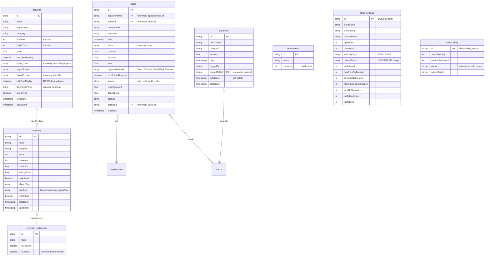
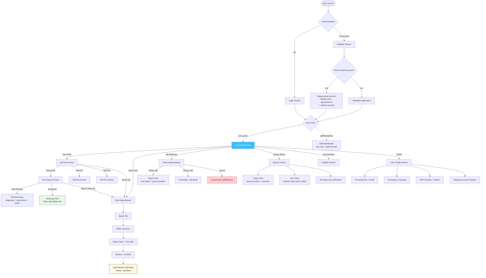
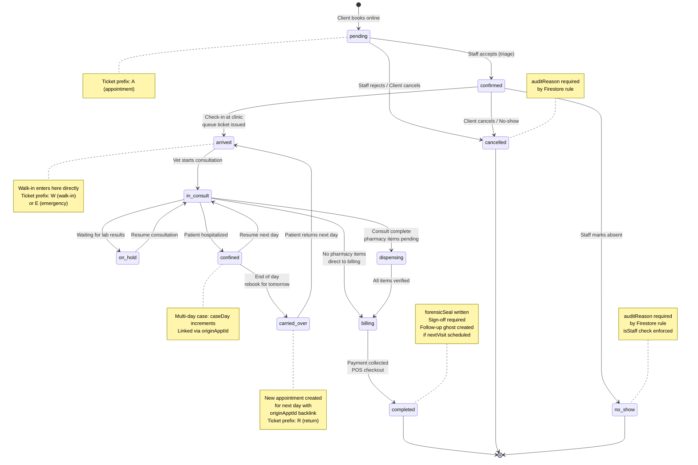

# VetConnect System Diagrams

> Paste each Mermaid block into [mermaid.live](https://mermaid.live) to render and export as PNG/SVG.

---

## 1. Firestore ERD (Entity Relationship Diagram)

> This is split into two diagrams for readability: Core Clinical and Supporting Collections.

### 1A. Core Clinical Collections

```mermaid
erDiagram
    users {
        string id PK "Firebase Auth UID"
        string fullName
        string email
        string phone "PH format 09xxxxxxxxx"
        string role "pet_owner | veterinarian | groomer | staff | admin"
        string accountStatus "active | unclaimed_guest | admin_registered"
        array departments "staff only"
        string address
        string city
        string gender
        timestamp dob
        string seniorId
        string govIdType
        string govIdNumber
        array emergencyContacts
        string emergencyName "flat field for BookAppointment"
        string emergencyPhone
        boolean profileComplete
        boolean disabled "staff revocation flag"
        boolean dpaConsent
        string pushToken "Expo push notifications"
        timestamp createdAt
        timestamp updatedAt
    }

    pets {
        string id PK
        string ownerId FK "references users.id"
        string name
        string species "Dog | Cat | Bird | etc"
        string breed
        string gender
        timestamp dob
        boolean isNeutered
        string petAllergies "canonical field"
        float weight
        float lastWeight
        string microchipId
        object lastVitals "weight temp hr rr crt bcs pain"
        string status "active | archived"
        timestamp createdAt
    }

    appointments {
        string id PK
        string ownerId FK "references users.id"
        string petId FK "references pets.id"
        string petName "denormalized"
        string ownerName "denormalized"
        string status "12-state lifecycle"
        timestamp scheduledDate
        string scheduledDateStr "YYYY-MM-DD"
        string serviceType
        array services "multi-service support"
        string serviceCategory "department"
        string assignedVetId FK "references users.id"
        string assignedVet "denormalized vet name"
        int queueNumber
        string ticketPrefix "A=appt W=walkin E=emerg R=return"
        string priority "normal | high"
        timestamp timeArrived
        timestamp timeStarted
        timestamp timeCompleted
        boolean isWalkIn
        boolean isTriaged
        int caseDay "day counter for multi-day cases"
        string originApptId FK "continuation linkage"
        string parentAppointmentId FK "follow-up linkage"
        string parentRecordId FK "follow-up record ref"
        string followUpId FK "forward pointer"
        array clinicalPulse "audit event array"
        object forensicSeal "frozen metrics snapshot"
        string auditReason "required for cancel and no-show"
        float balanceRemaining
        string visitGroupId "multi-pet booking group"
        timestamp createdAt
    }

    medical_records {
        string id PK
        string petId FK "references pets.id"
        string ownerId FK "references users.id"
        string appointmentId FK "references appointments.id"
        string recordType "medical | grooming"
        timestamp date
        string vetName
        string vetId FK "references users.id"
        object soap "subjective objective assessment plan"
        string diagnosis
        array prescriptions
        object vitals "weight temp hr rr crt bcs pain"
        array vaccineAdministrations "multi-vaccine new format"
        object vaccineData "legacy single-vaccine"
        object dischargeSummary "instructions diagnosis meds"
        array labResults
        string patientStatus
        timestamp nextVisit
        object legal "isLocked signedBy signedAt"
        array clinicalAmendments
    }

    users ||--o{ pets : "owns"
    users ||--o{ appointments : "books"
    users ||--o{ medical_records : "authored by (vetId)"
    pets ||--o{ appointments : "scheduled for"
    pets ||--o{ medical_records : "has records"
    appointments ||--o| medical_records : "produces"
    appointments ||--o| appointments : "originApptId (continuation)"
    appointments ||--o| appointments : "parentAppointmentId (follow-up)"
```

### 1B. Supporting Collections (Financial, Inventory, Configuration)

---

## 2. System Flowchart (User Journeys)

### 2A. Client Mobile App Flow

### 2B. Admin Web Dashboard Flow

```mermaid
flowchart TD
    START([Browser - localhost:5173]) --> LOGIN[Admin Login]
    LOGIN --> ROLE_CHECK{Role Check}
    ROLE_CHECK -->|Disabled| BLOCKED[Access Denied<br/>signOut]
    ROLE_CHECK -->|pet_owner| BLOCKED
    ROLE_CHECK -->|staff/vet/groomer/admin| DASHBOARD[Dashboard<br/>4-tab analytics]

    DASHBOARD --> QUEUE_MGR[Queue Management]
    DASHBOARD --> PATIENTS[Patients CRM]
    DASHBOARD --> RECORDS[Medical Records]
    DASHBOARD --> SERVICES_MGR[Services Catalog]
    DASHBOARD --> INVENTORY_MGR[Inventory Management]
    DASHBOARD --> STAFF_MGR[Staff Directory]
    DASHBOARD --> SALES_MGR[Sales Ledger]
    DASHBOARD --> EXPENSES_MGR[Expenses Tracker]
    DASHBOARD --> MONITOR[Lobby Monitor<br/>fullscreen TV display]
    DASHBOARD --> SETTINGS[Clinic Settings]

    QUEUE_MGR --> TRIAGE[Triage Wizard<br/>accept/defer/reject]
    QUEUE_MGR --> CHECK_IN[Check-In<br/>assign staff + issue ticket]
    QUEUE_MGR --> WALK_IN[Walk-In Registration]
    QUEUE_MGR --> CLINICAL[Clinical Workspace<br/>SOAP + prescriptions + vaccines]
    QUEUE_MGR --> DISPENSE[Dispensing Verification]
    QUEUE_MGR --> POS[POS Modal<br/>billing + checkout]
    QUEUE_MGR --> EOD[End of Day Modal<br/>3-silo reconciliation]

    CLINICAL --> SOAP[SOAP Notes<br/>per-service progress]
    CLINICAL --> RX[Prescriptions<br/>inventory-linked]
    CLINICAL --> VACCINE[Vaccine Administration<br/>catalog dropdown]
    CLINICAL --> LABS[Lab Results]
    CLINICAL --> DISCHARGE[Discharge Summary<br/>sign-off flow]

    PATIENTS --> CLIENT_LIST[Client Directory]
    PATIENTS --> PATIENT_DASH[Patient Dashboard<br/>vitals + weight + records]
    PATIENTS --> BILLING[Billing Ledger<br/>outstanding balances]
    PATIENTS --> REFERRAL[Referral Report]

    RECORDS --> SILO_VIEW[5-Silo View<br/>Triage/Clinical/In-Patient/Archive/Voided]
    RECORDS --> CASE_VIEW[Case Grouping<br/>visit chains]
    RECORDS --> BULK_OPS[Bulk Reschedule<br/>+ Staff Reassignment]
    RECORDS --> AMENDMENTS[Clinical Amendments<br/>append-only audit trail]

    SALES_MGR --> EOD_SUMMARY[EOD Summary<br/>collected + billed + refunds]
    SALES_MGR --> REFUND[Refund Processing<br/>inventory reversal]
    SALES_MGR --> VOID[Transaction Void]

    EOD --> CONFINE[Confine<br/>hospitalize overnight]
    EOD --> CARRY_OVER[Carry-Over<br/>rebook for tomorrow]
    EOD --> CANCEL_EOD[Cancel with audit reason]

    style DASHBOARD fill:#3ABEF9,color:#fff
    style CLINICAL fill:#FFF8E1,stroke:#3E2723
    style POS fill:#E8F5E9,stroke:#2E7D32
    style EOD fill:#FFCDD2,stroke:#D32F2F
    style MONITOR fill:#212121,color:#fff
```

---

## 3. Appointment Status Lifecycle

---

## Notes for Defense Panel

- **Firestore is a NoSQL document database** — there are no JOIN operations. Relationships are maintained via ID references (ownerId, petId, appointmentId) and resolved client-side.
- **Denormalized fields** (petName on appointments, ownerName on sales) are intentional for read performance — the trade-off is documented in the thesis as a conscious architectural decision.
- **The dual linkage system** (originApptId for continuations vs parentAppointmentId for follow-ups) is by design — see handoff.json `dual_linkage_rationale` for the 5 reasons they cannot be unified.
- **12 appointment statuses** is clinically accurate for a Philippine vet practice that handles walk-ins, hospitalizations, and multi-day cases.
