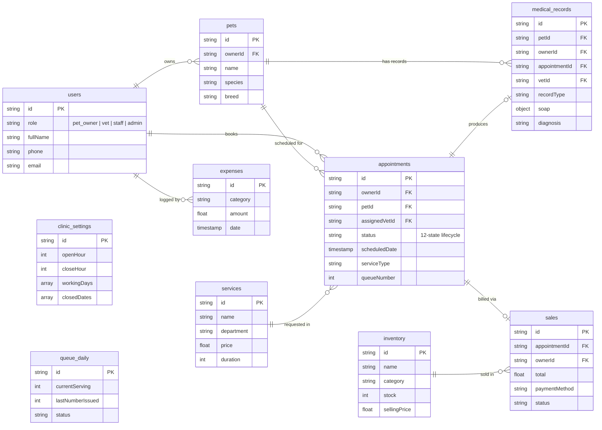
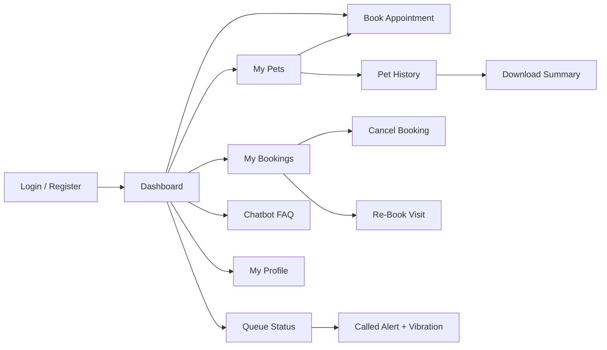
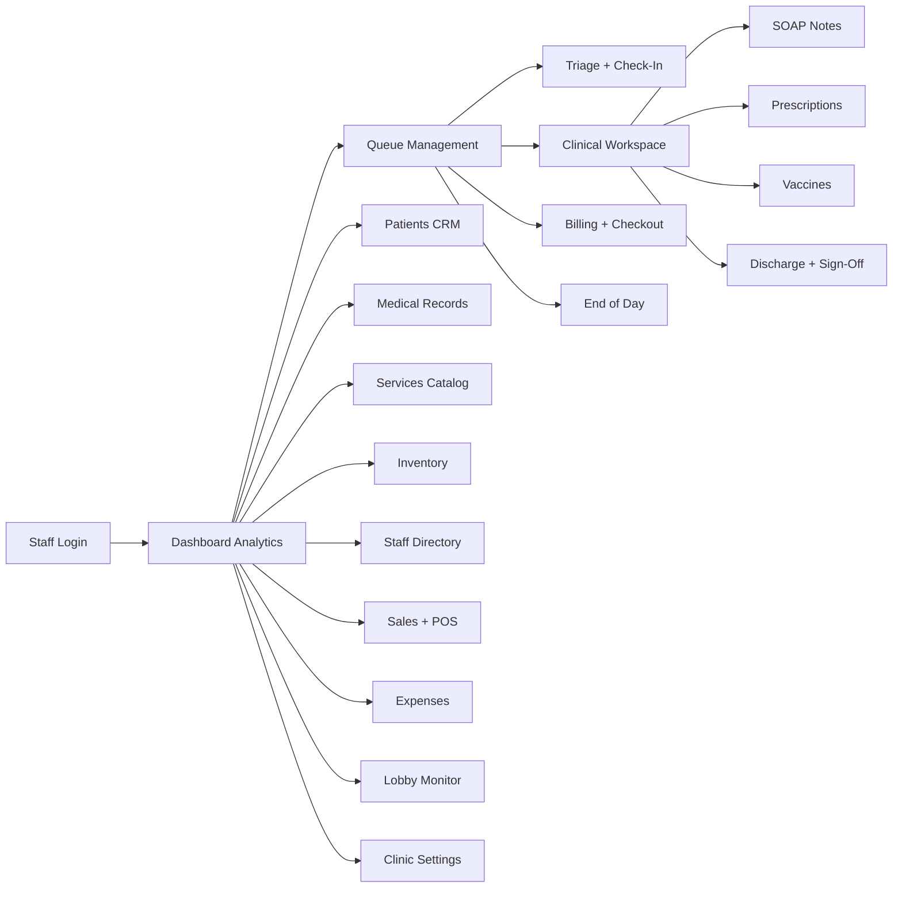
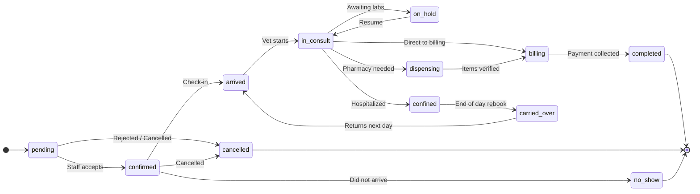

# VetConnect System Diagrams (Print-Friendly)

> Simplified versions for printed hardcopy. Full field details in VETCONNECT_DIAGRAMS.md.

---

## 1. Firestore ERD (Simplified)

---

## 2A. Client Mobile App Flow

## 2B. Admin Web Dashboard Flow

---

## 3. Appointment Status Lifecycle

