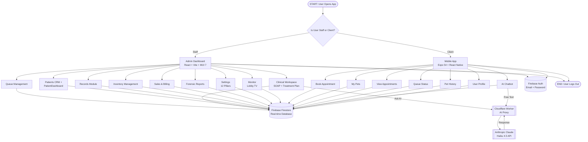
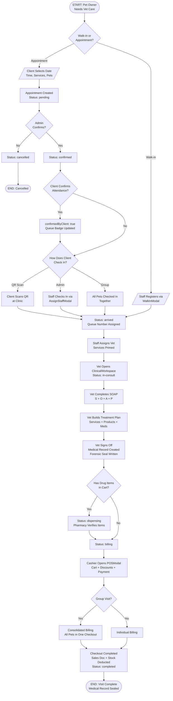
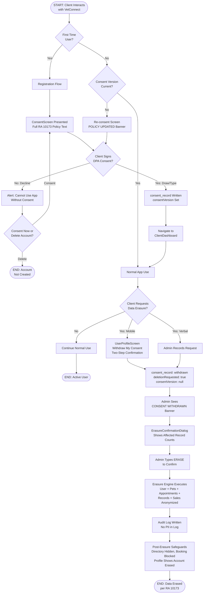
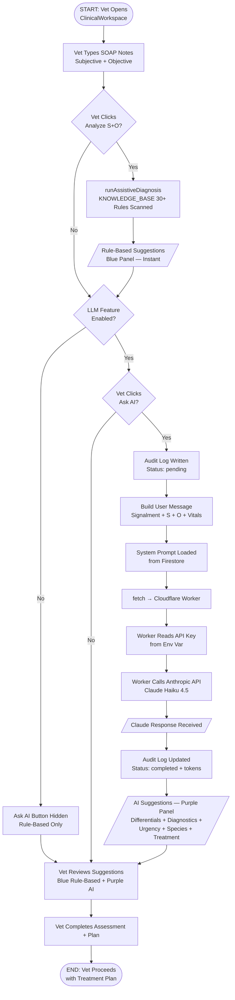
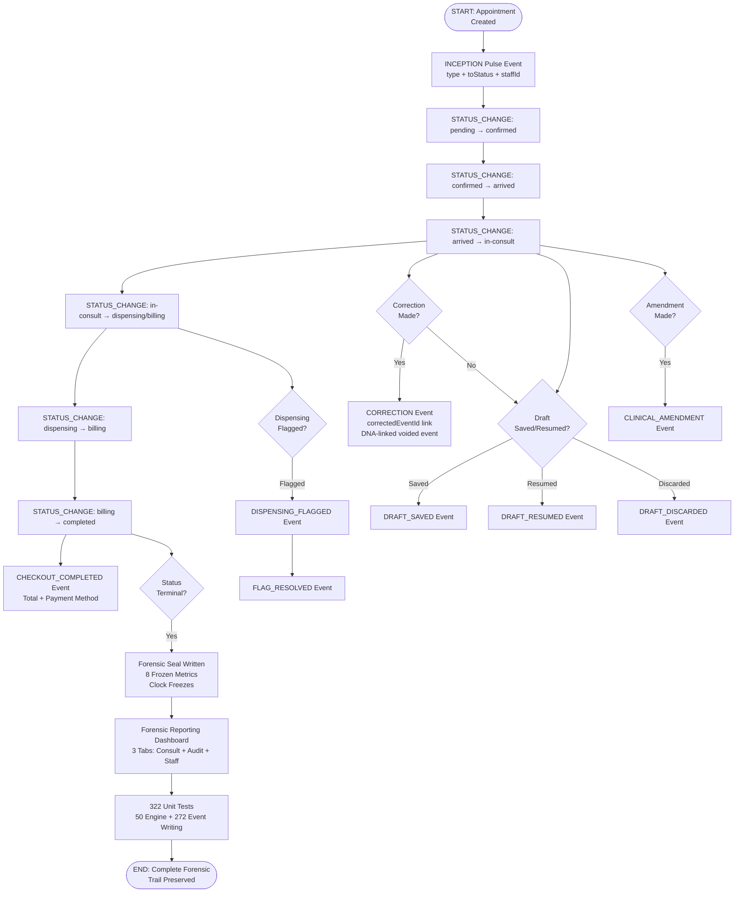
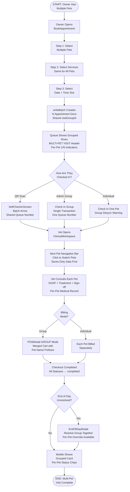
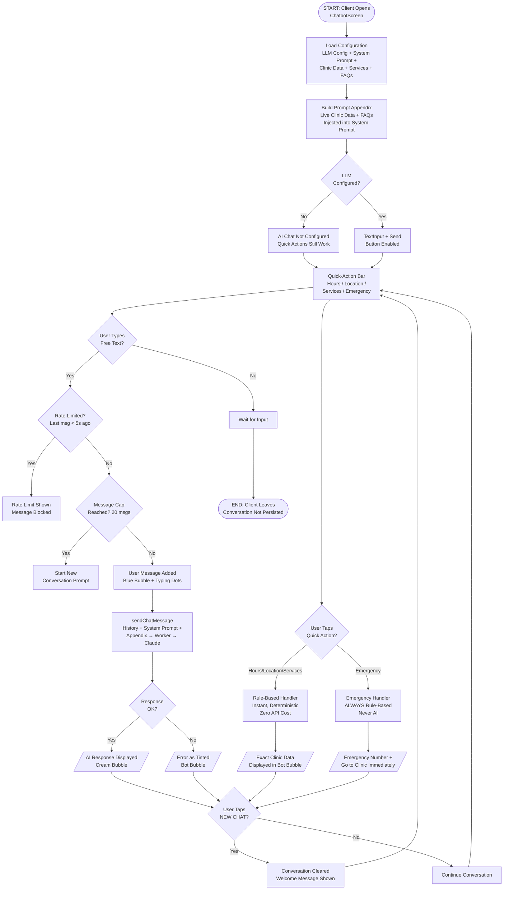

# VetConnect Ecosystem Flowcharts

**Created:** 2026-04-27
**Standard:** All flowcharts use standard shapes — Oval (Start/End), Rectangle (Process), Diamond (Decision), Parallelogram (I/O), Double-Rectangle (Predefined Process/Sub-routine)

---

## 1. High-Level System Overview

### Text Description (for manual drawing)

```
[OVAL] START: User Opens App

[DIAMOND] Is User Staff or Client?
  → Staff: [RECTANGLE] Admin Dashboard (React, Vite, MUI 7)
  → Client: [RECTANGLE] Mobile App (Expo 54, React Native)

--- ADMIN DASHBOARD BRANCH ---
[RECTANGLE] Admin Dashboard
  → [RECTANGLE] Queue Management
  → [RECTANGLE] Clinical Workspace (SOAP + Treatment Plan)
  → [RECTANGLE] Patients CRM + PatientDashboard
  → [RECTANGLE] Records Module
  → [RECTANGLE] Inventory Management
  → [RECTANGLE] Sales & Billing
  → [RECTANGLE] Forensic Reports
  → [RECTANGLE] Settings (12 Pillars)
  → [RECTANGLE] Monitor (Lobby TV)
  → [RECTANGLE] Expenses

--- MOBILE APP BRANCH ---
[RECTANGLE] Mobile App
  → [RECTANGLE] Book Appointment
  → [RECTANGLE] My Pets
  → [RECTANGLE] View Appointments
  → [RECTANGLE] Queue Status
  → [RECTANGLE] Pet History
  → [RECTANGLE] AI Chatbot
  → [RECTANGLE] User Profile

--- SHARED BACKEND ---
[DOUBLE-RECTANGLE] Firebase Firestore (Real-time Database)
  ↔ Admin Dashboard (onSnapshot listeners)
  ↔ Mobile App (onSnapshot + getDocs)

[DOUBLE-RECTANGLE] Firebase Auth (Email/Password)
  ↔ Admin Dashboard
  ↔ Mobile App

[DOUBLE-RECTANGLE] Cloudflare Worker (AI Proxy)
  → [DOUBLE-RECTANGLE] Anthropic Claude Haiku 4.5 API
  ← Response to Admin (Clinical Reasoning) + Mobile (Chatbot)

[OVAL] END: User Logs Out
```

### Mermaid Code



---

## 2. Complete Patient Journey (Clinical Workflow)

### Text Description

```
[OVAL] START: Pet Owner Needs Veterinary Care

[DIAMOND] Walk-in or Appointment?
  → Appointment: [PARALLELOGRAM] Client Selects Date/Time/Services/Pets via Mobile App
  → Walk-in: [PARALLELOGRAM] Staff Registers Walk-in via WalkInModal

[RECTANGLE] Appointment Created in Firestore
  Status: "pending"

[DIAMOND] Admin Confirms?
  → Yes: [RECTANGLE] Status → "confirmed"
  → No/Cancel: [RECTANGLE] Status → "cancelled" → [OVAL] END

[DIAMOND] Client Confirms Attendance? (T3.32)
  → Yes: [RECTANGLE] confirmedByClient: true, Queue Badge shows "CLIENT CONFIRMED"
  → No: continues without confirmation

[DIAMOND] How does Client Check In?
  → QR Code: [RECTANGLE] Client Scans QR at Clinic (SelfCheckInScreen)
  → Admin Check-in: [RECTANGLE] Staff Checks In via AssignStaffModal
  → Group Check-in: [RECTANGLE] All Pets in Visit Group Checked In Together (T3.12)

[RECTANGLE] Status → "arrived", Queue Number Assigned
  Pulse Event: STATUS_CHANGE (confirmed → arrived)

[RECTANGLE] Staff Assigns Vet + Services Primed
  Queue Position Visible on Mobile QueueScreen

[RECTANGLE] Vet Opens ClinicalWorkspace
  Status → "in-consult"
  Pulse Event: STATUS_CHANGE (arrived → in-consult)

[RECTANGLE] Vet Completes SOAP Form
  - Subjective (with intake context: client notes + staff triage)
  - Objective (vitals: weight, temp, HR, RR, CRT, BCS, pain)
  - Assessment (differential diagnosis + AI clinical reasoning)
  - Plan (treatment plan + discharge instructions)

[RECTANGLE] Vet Builds Treatment Plan (treatmentCart)
  - Add services, products, medications from inventory
  - Drug items get auto-populated dosing instructions (T3.110)
  - Vaccine form if vaccination visit (or manual toggle T3.2)

[RECTANGLE] Vet Signs Off (handleSaveConsult)
  - Medical record created (SOAP + vitals + dispensedProducts + dischargeSummary)
  - Forensic seal written
  - Pulse Event: STATUS_CHANGE (in-consult → dispensing/billing)

[DIAMOND] Has Drug Items in Cart?
  → Yes: [RECTANGLE] Status → "dispensing"
         [RECTANGLE] Pharmacy Staff Verifies Items (DispensingVerificationDialog)
           - Stock warnings shown (T3.37)
           - Batch/lot selection (T3.38)
           - Partial dispensing supported (T3.39)
           - Hold for vet review option (T3.36)
         [RECTANGLE] Status → "billing"
         Pulse Event: STATUS_CHANGE (dispensing → billing)
  → No:  [RECTANGLE] Status → "billing" (skip dispensing)

[RECTANGLE] Cashier Opens POSModal
  - Cart shows encounterItems (services + products)
  - SC/PWD discounts applied if eligible
  - Payment method selected (Cash/GCash/Card/Bank Transfer)

[DIAMOND] Group Visit? (T3.12)
  → Yes: [RECTANGLE] Consolidated Billing (all pets in one checkout)
  → No:  [RECTANGLE] Individual Billing

[RECTANGLE] Checkout Completed
  - Sales doc created (with checkoutCorrelationId T3.72)
  - Inventory stock deducted (FIFO batch)
  - Status → "completed"
  - Pulse Event: CHECKOUT_COMPLETED

[OVAL] END: Visit Complete — Medical Record Sealed
```

### Mermaid Code



---

## 3. Data Privacy / RA 10173 Flow

### Text Description

```
[OVAL] START: Client Interacts with VetConnect

[DIAMOND] First Time User?
  → Yes: [RECTANGLE] Registration Flow (RegisterScreen)
         [RECTANGLE] ConsentScreen Presented (Full RA 10173 Policy Text)
         [DIAMOND] Client Signs DPA Consent?
           → Yes (Draw/Type Signature): [RECTANGLE] consent_record Written
                Status: consentVersion set, dpaConsent: true
                [RECTANGLE] Navigate to ClientDashboard
           → No (Decline): [RECTANGLE] Alert: Cannot Use App Without Consent
                [DIAMOND] Consent Now or Delete Account?
                  → Consent Now: return to ConsentScreen
                  → Delete: [OVAL] END: Account Not Created
  → No: [DIAMOND] Consent Version Current?
         → Yes: [RECTANGLE] Normal App Use
         → No (Policy Updated): [RECTANGLE] Re-consent Screen Shown
              "POLICY UPDATED — Version N" banner
              Must re-sign before continuing

[RECTANGLE] Normal App Use — Data Collected:
  - Personal info (name, phone, email, address)
  - Pet profiles (name, species, breed, weight, allergies)
  - Appointment history
  - Medical records (SOAP, vitals, prescriptions)
  - Payment history

--- WITHDRAWAL FLOW ---

[DIAMOND] Client Requests Data Erasure?
  → Via Mobile: [RECTANGLE] UserProfileScreen → "Withdraw My Consent"
    Two-step Alert confirmation
    [RECTANGLE] consent_record: action "withdrawn"
    [RECTANGLE] User flagged: deletionRequested: true, consentVersion: null
  → Via Clinic: [RECTANGLE] Verbal request → Admin processes

[RECTANGLE] Admin Sees "CONSENT WITHDRAWN" Banner in PatientDashboard
[RECTANGLE] Admin Clicks "Process Erasure"
[RECTANGLE] ErasureConfirmationDialog Opens
  - Shows affected record counts (users, pets, appointments, records, sales)
  - Admin types "ERASE" to confirm (irreversible)

[RECTANGLE] Erasure Engine Executes (useErasureEngine)
  - User doc: fullName → "Deleted User", PII fields nulled
  - Pet docs: name → "[Redacted Pet]" (microchip preserved per §13(d))
  - Appointments: ownerName/petName anonymized, future appointments cancelled
  - Medical records: ownerName/petName anonymized, dischargeSummary anonymized
    (SOAP notes preserved for clinical continuity, consent on file redacted)
  - Sales: ownerName/petName anonymized (amounts/dates preserved for tax audit)
  - User doc updated LAST: accountStatus → "erased"

[RECTANGLE] Audit Log Written to settings_logs (no PII in log)

[RECTANGLE] Post-Erasure Safeguards:
  - Erased users hidden from Patients directory
  - Mobile: booking blocked, profile shows "Account Erased" notice
  - PatientDashboard: erased banner + disabled edit controls

[OVAL] END: Data Erased per RA 10173
```

### Mermaid Code



---

## 4. AI Clinical Reasoning Flow

### Text Description

```
[OVAL] START: Vet Opens ClinicalWorkspace for a Patient

[RECTANGLE] Vet Types SOAP Notes
  - Subjective: client-reported symptoms
  - Objective: clinical observations + vitals

[DIAMOND] Vet Clicks "Analyze S+O"?
  → Yes: [RECTANGLE] runAssistiveDiagnosis() Executes
         [RECTANGLE] KNOWLEDGE_BASE (30+ Rules) Scanned
           - Concatenates S + O text, lowercased
           - Each rule: if ANY keyword matches → suggestion added
         [PARALLELOGRAM] Rule-Based Suggestions Displayed (Blue Panel)
           - Instant (<10ms)
           - Multiple rules can match
           - "CLINICAL INTELLIGENCE SUGGESTIONS" header
  → No: (vet proceeds without analysis)

[DIAMOND] LLM Feature Enabled? (llmEnabled === true && workerUrl configured)
  → No: [RECTANGLE] "Ask AI" Button Hidden — Rule-Based Only
  → Yes: [DIAMOND] Vet Clicks "Ask AI"?
         → No: (vet uses rule-based suggestions only)
         → Yes:
           [RECTANGLE] Audit Log Written (status: pending)
             llm_audit_logs: staffId, appointmentId, promptSummary

           [RECTANGLE] Build User Message
             - Patient signalment (species, breed, age, weight)
             - Subjective text
             - Objective text + all 7 vitals

           [RECTANGLE] System Prompt Loaded
             From Firestore: system_prompts/clinical_reasoning
             (5-section structured output format)

           [RECTANGLE] fetch() → Cloudflare Worker
             (cool-fire-2d53.jepdd15.workers.dev)

           [RECTANGLE] Worker Reads API Key from Env Var
             (ANTHROPIC_API_KEY — never in browser)

           [RECTANGLE] Worker Calls Anthropic API
             Model: claude-haiku-4-5-20251001
             Max tokens: 1024

           [PARALLELOGRAM] Claude Haiku Response Received

           [RECTANGLE] Audit Log Updated (status: completed)
             responseSummary, tokenCount

           [PARALLELOGRAM] AI Suggestions Displayed (Purple Panel)
             - 1. Differential Diagnosis (ranked, confidence levels)
             - 2. Recommended Diagnostics (prioritized)
             - 3. Urgency Assessment (Emergency/Urgent/Routine)
             - 4. Species-Specific Considerations
             - 5. Treatment Considerations
             - Disclaimer: "AI-generated. Always verify with clinical judgment."

[RECTANGLE] Vet Reviews Both Panels (Blue Rule-Based + Purple AI)
[RECTANGLE] Vet Completes Assessment + Plan Based on Suggestions

[OVAL] END: Vet Proceeds with Treatment Plan
```

### Mermaid Code



---

## 5. Forensic Audit Trail Flow

### Text Description

```
[OVAL] START: Appointment Created

[RECTANGLE] INCEPTION Pulse Event Written
  { type: "INCEPTION", toStatus: "arrived/pending", staffId, timestamp }

--- FOR EVERY STATUS CHANGE ---

[RECTANGLE] STATUS_CHANGE Pulse Event Written
  { type: "STATUS_CHANGE", fromStatus, toStatus, staffId, staffName, timestamp }
  Examples:
    pending → confirmed
    confirmed → arrived
    arrived → in-consult
    in-consult → dispensing (T3.78 fix)
    dispensing → billing
    billing → completed

--- SPECIAL EVENTS ---

[DIAMOND] Was a Correction Made?
  → Yes: [RECTANGLE] CORRECTION Pulse Event Written
         { type: "CORRECTION", fromStatus, toStatus, correctedEventId,
           isCorrection: true, note: "TERMINAL REVERSAL: reason" }
         Voided event linked via correctedEventId (DNA link)

[DIAMOND] Was a Draft Saved/Resumed?
  → Saved: [RECTANGLE] DRAFT_SAVED Pulse Event (T3.75)
  → Resumed: [RECTANGLE] DRAFT_RESUMED Pulse Event (T3.75)
  → Discarded: [RECTANGLE] DRAFT_DISCARDED Pulse Event

[DIAMOND] Was a Clinical Amendment Made?
  → Yes: [RECTANGLE] CLINICAL_AMENDMENT Pulse Event (T2.453)

[DIAMOND] Was Dispensing Flagged/Resolved?
  → Flagged: [RECTANGLE] DISPENSING_FLAGGED Pulse Event (T3.36)
  → Resolved: [RECTANGLE] FLAG_RESOLVED Pulse Event

[DIAMOND] Was Checkout Completed?
  → Yes: [RECTANGLE] CHECKOUT_COMPLETED Pulse Event
         { staffId, note: "Checkout: ₱{total} via {method}" }

--- TERMINAL STATE ---

[DIAMOND] Is Status Terminal? (completed/cancelled/no-show)
  → Yes: [RECTANGLE] Forensic Seal Written
         { 8 frozen metrics: recordAge, opHoursAge, shiftQueue,
           totalQueue, shiftConsult, totalConsult, shiftConfined, totalConfined }
         Clock FREEZES at terminal event timestamp

--- REPORTING ---

[RECTANGLE] Forensic Reporting Dashboard (/reports)
  - Tab 1: Consult Performance (duration distribution, by-vet, by-dept)
  - Tab 2: Audit Integrity (pulse coverage %, seal coverage, corrections log)
  - Tab 3: Staff Workload (patients per vet, consult hours)
  - Date range picker with Manila timezone
  - Printable HTML report per tab

[RECTANGLE] 322 Unit Tests Validate:
  - 50 tests: calculatePulseMetrics (math engine)
  - 272 tests: pulse event writing correctness (29 builders, 23 write sites)

[OVAL] END: Complete Forensic Trail Preserved
```

### Mermaid Code



---

## 6. Multi-Pet Visit Flow

### Text Description

```
[OVAL] START: Owner Has Multiple Pets Needing Vet Care

[RECTANGLE] Owner Opens BookAppointment (Mobile)
[RECTANGLE] Step 1: Select Multiple Pets (checkboxes)
[RECTANGLE] Step 2: Select Services (same for all pets)
[RECTANGLE] Step 3: Select Date/Time Slot

[RECTANGLE] writeBatch Creates N Appointment Docs
  - All share: visitGroupId (VG-{uid5}-{timestamp})
  - Each has: groupSize, groupIndex (0-based)
  - All share: same scheduledDate, same services

[RECTANGLE] Appointments Appear in Admin Queue
  - Grouped by visitGroupId
  - Group header: "MULTI-PET VISIT (N)"
  - Per-pet: "(1/N)" indicator next to pet name
  - Emergency priority preserved (entire group floats to top if any pet is emergency)

[DIAMOND] How Are They Checked In?
  → Mobile QR: [RECTANGLE] SelfCheckInScreen batch-arrive
    All pets get SAME queue number (Option C: shared number)
  → Admin: [RECTANGLE] "Check In Group (N pets)" context menu
    AssignStaffModal shows all pets
    Single transaction: one queue number, all status → arrived
  → Individual: [RECTANGLE] Staff checks in one pet at a time
    Warning if part of group

[RECTANGLE] Vet Opens ClinicalWorkspace
  - "Next Pet" navigation bar at top
  - Shows: [Mochi (In-Consult)] [Bella (Arrived)] [Rocky (Arrived)]
  - Click to switch pets (saves dirty SOAP data first)

[RECTANGLE] Vet Consults Each Pet Sequentially
  Per-pet: SOAP + Treatment Plan + Sign-off
  Each creates its own medical record

[DIAMOND] Billing Mode?
  → Group: [RECTANGLE] POSModal GROUP/INDIVIDUAL toggle
    Merged cart with pet-name prefixes
    "[Mochi] Rabies Vaccine", "[Bella] Deworming"
    Single sales doc with visitGroupId + perPetBreakdown
  → Individual: [RECTANGLE] Each pet billed separately

[RECTANGLE] Checkout Completed
  - All appointment statuses → completed
  - One or N sales docs depending on billing mode

[DIAMOND] End of Day — Unresolved Group?
  → Yes: [RECTANGLE] EndOfDayModal groups them together
    "Resolve Group" applies same resolution to all
    Per-pet override available (carry-over one, cancel another)

[RECTANGLE] Mobile ClientAppointments shows grouped card
  - Single card for the visit group
  - Per-pet status chips inside
  - Group cancel cancels all

[OVAL] END: Multi-Pet Visit Complete
```

### Mermaid Code



---

## 7. AI Chatbot Flow (Mobile Client)

### Text Description

```
[OVAL] START: Client Opens ChatbotScreen

[RECTANGLE] Load Configuration on Mount:
  - Read clinic_settings/llm_config (llmEnabled, workerUrl)
  - Read system_prompts/chatbot_assistant (system prompt)
  - Read clinic_settings/general (hours, address, phone)
  - Read services collection (names + prices)
  - Read faqs collection (active FAQ entries)
  - Build promptAppendix (live clinic data + FAQs injected into system prompt)

[DIAMOND] LLM Configured? (llmEnabled && workerUrl)
  → No: [RECTANGLE] Show "AI chat is not yet configured. Contact clinic staff."
        Quick-action buttons still work (rule-based)
  → Yes: [RECTANGLE] TextInput + Send Button Enabled

[RECTANGLE] Quick-Action Bar Displayed (Always Visible)
  Buttons: [Hours] [Location] [Services] [Emergency]

[DIAMOND] User Taps Quick-Action Button?
  → Hours/Location/Services: [RECTANGLE] Rule-Based Handler (Instant)
    Reads from Firestore clinic_settings
    Bot bubble shows exact clinic data
    [PARALLELOGRAM] Deterministic Answer Displayed
    (Zero API cost, zero latency)
  → Emergency: [RECTANGLE] Rule-Based Emergency Handler (ALWAYS)
    Shows emergency number + "Go to clinic immediately"
    NEVER uses AI (safety-critical, no dependency on external API)

[DIAMOND] User Types Free-Text Question?
  → No: [RECTANGLE] Wait for user input
  → Yes:
    [DIAMOND] Rate Limited? (last message < 5 seconds ago)
      → Yes: [RECTANGLE] Rate limit indicator shown, message blocked
      → No: continue

    [DIAMOND] Message Cap Reached? (20 messages)
      → Yes: [RECTANGLE] "Start new conversation" prompt shown
      → No: continue

    [RECTANGLE] User Message Appended to Chat (right-aligned, blue bubble)
    [RECTANGLE] Typing Indicator Shown (animated dots)

    [RECTANGLE] sendChatMessage() Called
      - Full conversation history sent (multi-turn context)
      - System prompt + promptAppendix concatenated
      - fetch() → Cloudflare Worker → Claude Haiku 4.5

    [DIAMOND] Response Successful?
      → Yes: [PARALLELOGRAM] AI Response Displayed (left-aligned, cream bubble)
             Conversation history updated
      → No:  [PARALLELOGRAM] Error Shown as Tinted Bot Bubble
             (NOT an Alert popup — inline error message)

[DIAMOND] User Taps "NEW CHAT"?
  → Yes: [RECTANGLE] Conversation History Cleared (in-memory only)
         Welcome message re-displayed
  → No: [RECTANGLE] Continue Conversation

[OVAL] END: Client Leaves ChatbotScreen
  (Conversation not persisted — in-memory only)
```

### Mermaid Code



---

## Notes for Thesis Presentation

### Standard Flowchart Shapes Used Throughout:
- **Oval** (rounded rectangle): Start and End terminals
- **Rectangle**: Process steps
- **Diamond**: Decision points (yes/no or multiple branches)
- **Parallelogram**: Input/Output (data display, user input)
- **Double-lined rectangle**: Predefined process / external system (Firestore, APIs)

### How to Render Mermaid Code:
1. **Online**: Paste into [mermaid.live](https://mermaid.live) → export as PNG/SVG
2. **VS Code**: Install "Mermaid Preview" extension → preview in editor
3. **draw.io**: Use the text descriptions to manually draw with proper shapes
4. **GitHub**: Mermaid renders natively in .md files

### Color Coding Suggestion for Presentation:
- **Blue**: Mobile app flows
- **Green**: Admin dashboard flows
- **Orange**: AI/LLM flows
- **Red**: Security/privacy flows
- **Purple**: Forensic audit flows
